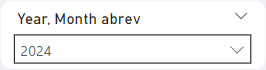
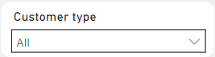
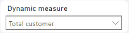
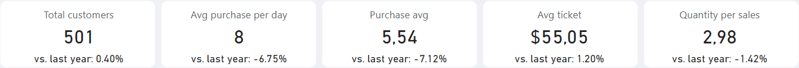
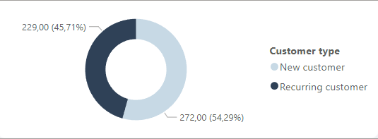
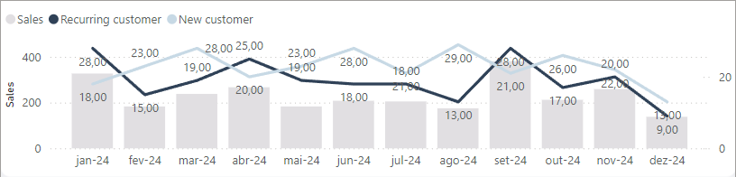
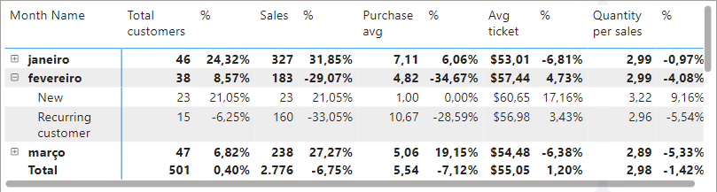
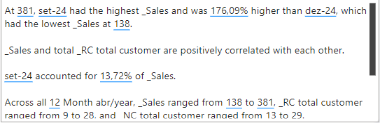

<h2>
This folder will contain all the relevant information used to build the project's visuals and filters. 
</h2>

<h3>Year, Month abrev. | filter</h3>

| Visual name                                      | Info                                      |
|------------------------------------------------|-----------------------------------------------|
| Filter | [Year](/Datasource/dimCalendar.md), [Month abrev](/Datasource/dimCalendar.md)|

<h3>Customer type  | filter</h3>

| Visual name                                      | Info                                      |
|------------------------------------------------|-----------------------------------------------|
| Filter | [Customer type](/Datasource/factSales.md)|

<h3>Dynamic measure | filter</h3>

| Visual name                                      | Info                                      |
|------------------------------------------------|-----------------------------------------------|
| Filter | [Button name](/Datasource/_Dynamic%20buttons.md)|

<h3>Cards | Visual</h3>

| Visual name                                      | Info                                      |
|------------------------------------------------|-----------------------------------------------|
| Card(new) | [Card 1 - Total customers](../Measures/Overall/_Total%20customers.md),  [Card 2 - Avg purchase per day](../Measures/Overall/_AVG%20purchase%20interval.md),  [Card 3 - Purchase avg](../Measures/Overall/_AVG%20Order%20by%20customer.md),  [Card 4 - Avg ticket](../Measures/Overall/_$%20average%20ticket.md),  [Card 5 - Quantity per sales](../Measures/Overall/_AVG%20quantity%20per%20sales.md),  [Card 1 - vs. last year 1](../Measures/Text%20format%20measures/_txt%20sply%20total%20customer.md),  [Card 2 - vs. last year 2](../Measures/Text%20format%20measures/_txt%20sply%20avg%20purchase%20per%20day.md),  [Card 3 - vs. last year 3](../Measures/Text%20format%20measures/_txt%20sply%20avg%20Order%20by%20customer.md),,  [Card 4 - vs. last year 4](../Measures/Text%20format%20measures/_txt%20sply%20average%20ticket.md),  [Card 5 - vs. last year 5](../Measures/Text%20format%20measures/_txt%20sply%20avg%20quantity%20per%20sales.md)|

<h3>Donut chart | Graphic</h3>

| Visual name                                      | Info                                      |
|------------------------------------------------|-----------------------------------------------|
| Donut chart | [Legend - Customer type](/Datasource/_Dynamic%20buttons.md),   [Values - _Overall dynamic measure](/Datasource/_Dynamic%20buttons.md)|

<h3>Line and stacked column chart | Graphic</h3>

| Visual name                                      | Info                                      |
|------------------------------------------------|-----------------------------------------------|
| Line and stacked column chart | [X axis - Month abr/year](/Datasource/dimCalendar.md),   [Column y axis - Sales](/Measures/Overall/_Sales.md),   [Line y axis - Recurring customer](/Measures/New%20and%20Recurring%20customers/_RC%20dynamic%20measures.md),   [Line y axis - New customer](/Measures/New%20and%20Recurring%20customers/_NC%20dynamic%20measures.md)|

<h3>Matrix | Visual</h3>

| Visual name                                      | Info                                      |
|------------------------------------------------|-----------------------------------------------|
| Matrix | [Rows - Month Name](/Datasource/dimCalendar.md),   [Rows - Customer type](/Datasource/factSales.md),   [Values - Total customers](/Measures/Overall/_Total%20customers.md),   [Values - %1](/Measures/Temporal%20measures/_%25SPLY%20total%20customer.md),   [Values - Sales](/Measures/Overall/_Sales.md),   [Values - %2](/Measures/Temporal%20measures/_%25SPLY%20sales.md),   [Values - Purchase avg](/Measures/Overall/_AVG%20Order%20by%20customer.md),   [Values - %3](/Measures/Temporal%20measures/_%25SPLY%20avg%20Order%20by%20customer.md),   [Values - Avg ticket](/Measures/Overall/_$%20average%20ticket.md),   [Values - %4](/Measures/Temporal%20measures/_%25SPLY%20average%20ticket.md),   [Values - Quantity per sales](/Measures/Overall/_AVG%20quantity%20per%20sales.md),   [Values - %5](/Measures/Temporal%20measures/_%25SPLY%20avg%20quantity%20per%20sales.md)|

<h3>Smart insight | Text box</h3>

| Visual name                                      | Info                                      |
|------------------------------------------------|-----------------------------------------------|
| Narrative - AI visual | -|
